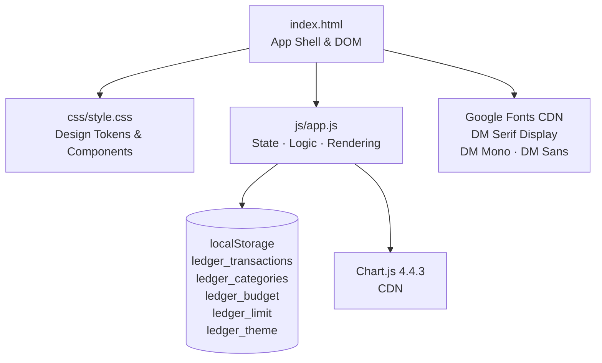
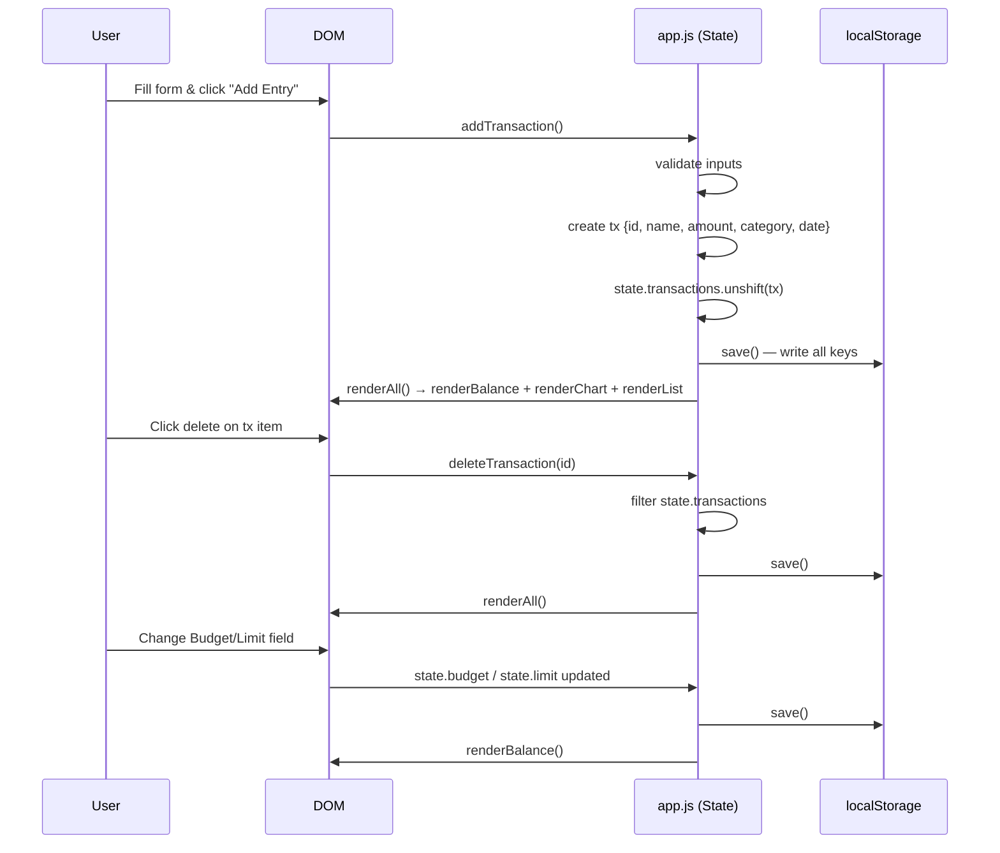
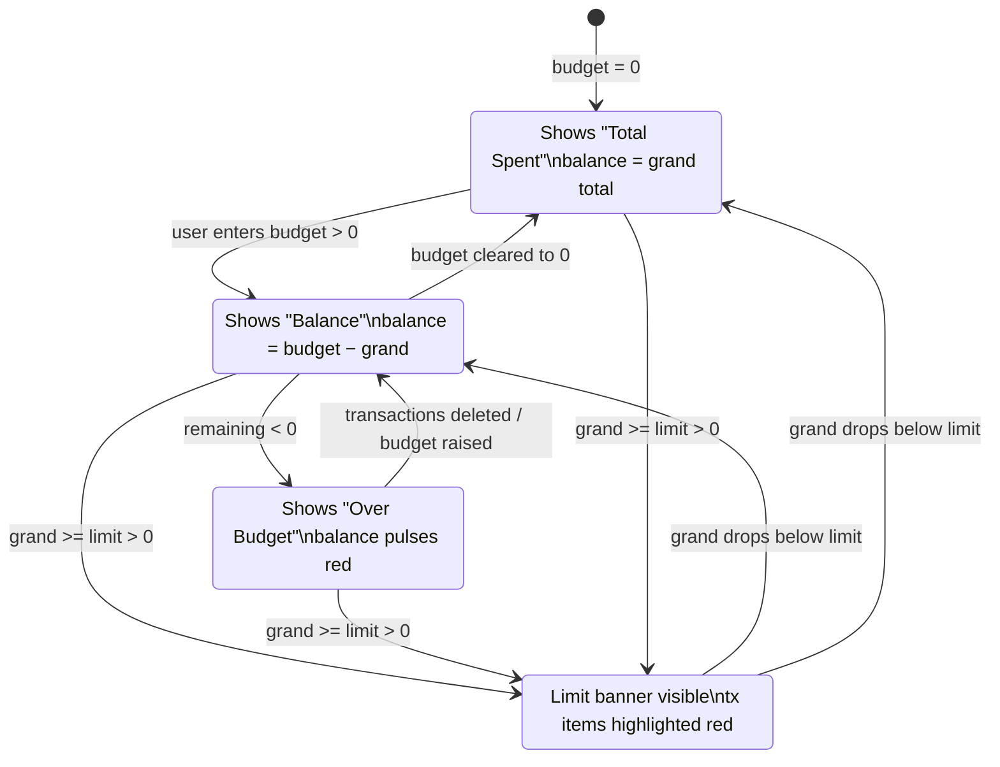

# Design Document: Ledger — Expense Tracker

## Overview

Ledger is a client-side expense tracking application built with vanilla HTML, CSS, and JavaScript. It runs entirely in the browser with no backend, persisting all state to `localStorage`. The app lets users log transactions by name, amount, and category; visualize spending via a doughnut chart; set a budget and/or spending limit; and review a monthly summary — all with dark/light theme support.

The architecture is a single-page application with a flat module structure: one HTML shell, one CSS file of design tokens and component styles, and one JavaScript file that owns all state, persistence, rendering, and event handling.

## Architecture



### Component Breakdown

```mermaid
graph LR
    subgraph UI Sections
        H[Header<br/>logo · summary toggle · theme toggle]
        BH[Balance Hero<br/>amount · stats · bar · limit banner]
        SP[Summary Panel<br/>monthly stats grid]
        CS[Chart Section<br/>doughnut + legend]
        FS[Form Section<br/>new entry inputs]
        LS2[List Section<br/>sorted transactions]
        CM[Category Modal<br/>add custom category]
    end

    subgraph JS Responsibilities
        STATE[State Object<br/>transactions · categories<br/>limit · budget · sortMode · chart]
        PERSIST[Persistence<br/>load · save]
        COMPUTE[Computation<br/>computeTotals · sortedTransactions]
        RENDER[Rendering<br/>renderBalance · renderBalanceBar<br/>renderChart · renderList · renderSummary]
        ACTIONS[Actions<br/>addTransaction · deleteTransaction<br/>confirmAddCategory · toggleTheme]
    end

    UI Sections --> JS Responsibilities
```

## Data Flow



## State Machine — Balance Hero Display



## Components and Interfaces

### State Object

```typescript
interface AppState {
  transactions: Transaction[];
  categories:   Category[];
  limit:        number;       // spending alert threshold (0 = disabled)
  sortMode:     SortMode;
  budget:       number;       // starting budget (0 = disabled)
  chart:        Chart | null; // Chart.js instance
}

type SortMode = 'date-desc' | 'date-asc' | 'amount-desc' | 'amount-asc' | 'category';
```

### Data Models

```typescript
interface Transaction {
  id:       string;   // Date.now().toString()
  name:     string;   // user-entered, HTML-escaped on render
  amount:   number;   // positive float
  category: string;   // must match a Category.name in state
  date:     string;   // ISO 8601 string
}

interface Category {
  name:  string;  // display name, case-insensitive unique
  color: string;  // hex color string e.g. "#f0a500"
}

interface TotalsResult {
  totals: Record<string, number>; // category name → total amount
  grand:  number;                 // sum of all transaction amounts
}
```

### Base Data

```typescript
const BASE_CATEGORIES: Category[] = [
  { name: 'Food',      color: '#f0a500' },
  { name: 'Transport', color: '#4db6c6' },
  { name: 'Fun',       color: '#a07df0' },
];

// 10-color cycling palette for user-added categories
const CUSTOM_COLORS: string[] = [
  '#e87b5a','#6db87a','#e06fa0','#60c0e0','#c0a060',
  '#7ab8e8','#d4a060','#80c090','#d080b0','#90b8d0',
];
```

### localStorage Keys

| Key                   | Type     | Description                        |
|-----------------------|----------|------------------------------------|
| `ledger_transactions` | JSON     | `Transaction[]`                    |
| `ledger_categories`   | JSON     | `Category[]`                       |
| `ledger_budget`       | string   | Budget amount as numeric string    |
| `ledger_limit`        | string   | Spending limit as numeric string   |
| `ledger_theme`        | string   | `"dark"` or `"light"`              |

## Key Functions with Formal Specifications

### `computeTotals() → TotalsResult`

**Preconditions:**
- `state.transactions` is a valid array (may be empty)

**Postconditions:**
- Returns `{ totals, grand }` where `grand` equals the sum of all `tx.amount` values
- `totals[cat]` equals the sum of amounts for all transactions in that category
- If no transactions exist, `grand === 0` and `totals` is an empty object

### `renderBalance()`

**Preconditions:**
- DOM elements `totalBalance`, `balanceLabel`, `statBudget`, `statSpent`, `limitBanner`, `limitMessage`, `balanceBar` exist

**Postconditions:**
- If `state.budget > 0`: displays `budget − grand`; label is "Balance" or "Over Budget"
- If `state.budget === 0`: displays `grand`; label is "Total Spent"
- `.over-limit` class on balance element iff `remaining < 0`
- Limit banner visible iff `state.limit > 0 && grand >= state.limit`
- Calls `renderBalanceBar(grand)`

### `addTransaction()`

**Preconditions:**
- `itemName`, `itemAmount`, `itemCategory` DOM inputs exist

**Postconditions:**
- If validation fails: error message shown, state unchanged
- If valid: new `Transaction` prepended to `state.transactions`, `save()` called, `renderAll()` called, form inputs cleared
- Transaction `id` is `Date.now().toString()` (unique within a session)
- Transaction `date` is `new Date().toISOString()`

**Validation Rules:**
- `name` must be non-empty after trim
- `amount` must be a positive number
- `category` must be non-empty

### `deleteTransaction(id: string)`

**Preconditions:**
- `id` is a string

**Postconditions:**
- Transaction with matching `id` removed from `state.transactions`
- `save()` and `renderAll()` called
- No-op if `id` not found

### `confirmAddCategory()`

**Preconditions:**
- `newCategoryName` input exists in DOM

**Postconditions:**
- If name is empty: no-op
- If name already exists (case-insensitive): modal closed, no duplicate added
- Otherwise: new `Category` appended with next `CUSTOM_COLORS` color, `save()` called, select repopulated, new category auto-selected

### `sortedTransactions() → Transaction[]`

**Preconditions:**
- `state.sortMode` is one of the five valid `SortMode` values

**Postconditions:**
- Returns a new sorted array (does not mutate `state.transactions`)
- `date-desc`: descending ISO string comparison
- `date-asc`: ascending ISO string comparison
- `amount-desc`: descending numeric
- `amount-asc`: ascending numeric
- `category`: ascending alphabetical by category name

### `escHtml(str: string) → string`

**Postconditions:**
- Replaces `&`, `<`, `>`, `"` with their HTML entities
- Prevents XSS when injecting user content via `innerHTML`

## Algorithmic Pseudocode

### Main Render Pipeline

```pascal
PROCEDURE renderAll()
  SEQUENCE
    renderBalance()
    renderChart()
    renderList()
  END SEQUENCE
END PROCEDURE
```

### Add Transaction Flow

```pascal
PROCEDURE addTransaction()
  INPUT: DOM form fields (itemName, itemAmount, itemCategory)

  SEQUENCE
    name   ← trim(itemName.value)
    amount ← parseFloat(itemAmount.value)
    cat    ← itemCategory.value

    IF name = '' THEN
      showError('Please enter an item name.')
      RETURN
    END IF

    IF amount <= 0 OR amount IS NaN THEN
      showError('Please enter a valid amount.')
      RETURN
    END IF

    IF cat = '' THEN
      showError('Please select a category.')
      RETURN
    END IF

    tx ← { id: Date.now(), name, amount, category: cat, date: now().toISOString() }
    state.transactions.prepend(tx)
    save()
    renderAll()
    clearInputs(itemName, itemAmount)
  END SEQUENCE
END PROCEDURE
```

### Compute Totals

```pascal
FUNCTION computeTotals()
  OUTPUT: { totals: map<string, number>, grand: number }

  SEQUENCE
    totals ← {}
    grand  ← 0

    FOR each tx IN state.transactions DO
      totals[tx.category] ← (totals[tx.category] OR 0) + tx.amount
      grand ← grand + tx.amount
    END FOR

    RETURN { totals, grand }
  END SEQUENCE
END FUNCTION
```

### Balance Bar Render

```pascal
PROCEDURE renderBalanceBar(grand)
  INPUT: grand (number)

  SEQUENCE
    bar ← DOM('#balanceBar')
    bar.clear()

    IF grand = 0 THEN RETURN END IF

    { totals } ← computeTotals()

    FOR each cat IN state.categories DO
      IF totals[cat.name] EXISTS THEN
        segment ← createDiv('.balance-bar-segment')
        segment.width ← (totals[cat.name] / grand) * 100 + '%'
        segment.background ← cat.color
        bar.append(segment)
      END IF
    END FOR
  END SEQUENCE
END PROCEDURE
```

### Category Deduplication

```pascal
PROCEDURE confirmAddCategory()
  SEQUENCE
    name ← trim(newCategoryName.value)
    IF name = '' THEN RETURN END IF

    IF state.categories.any(c => lowercase(c.name) = lowercase(name)) THEN
      closeCategoryModal()
      RETURN
    END IF

    colorIndex ← (state.categories.length - BASE_CATEGORIES.length) MOD CUSTOM_COLORS.length
    state.categories.append({ name, color: CUSTOM_COLORS[colorIndex] })
    save()
    populateCategorySelect()
    itemCategory.value ← name
    closeCategoryModal()
  END SEQUENCE
END PROCEDURE
```

## Example Usage

```typescript
// Bootstrap on DOMContentLoaded
init()
  → initTheme()          // restore dark/light from localStorage
  → load()               // hydrate state from localStorage
  → populateCategorySelect()
  → renderAll()          // initial paint

// User adds "Lunch" for Rp 25,000 under Food
addTransaction()
  // state.transactions = [{ id:"1700000000000", name:"Lunch", amount:25000, category:"Food", date:"2024-..." }, ...]
  // localStorage updated
  // chart, balance, list re-rendered

// User sets budget to Rp 500,000
// → balance shows Rp 475,000 remaining

// User adds Rp 600,000 more
// → balance shows -Rp 125,000, label "Over Budget", pulses red

// User sets spending limit to Rp 400,000 (already exceeded)
// → limit banner appears, all tx items highlighted red
```

## Correctness Properties

- For all transaction lists T, `computeTotals(T).grand === T.reduce((s,t) => s + t.amount, 0)`
- For all categories C in state, `sortedTransactions()` never mutates `state.transactions`
- For all user inputs S, `escHtml(S)` contains no unescaped `<`, `>`, `&`, or `"` characters
- Category names are unique (case-insensitive) — `confirmAddCategory` enforces this invariant
- The chart instance is always destroyed before recreation — no Chart.js "canvas already in use" errors
- `renderBalance` is the single source of truth for the hero display; no other function writes to those DOM elements

## Error Handling

### Invalid Form Input
- **Condition**: name empty, amount ≤ 0 or NaN, or no category selected
- **Response**: inline error message shown in `.error-msg` element with slide-in animation
- **Recovery**: user corrects input and resubmits; error clears on next successful submission

### Corrupt localStorage Data
- **Condition**: `JSON.parse` throws on stored transactions or categories
- **Response**: `load()` catches the error and resets to empty transactions and `BASE_CATEGORIES`
- **Recovery**: app starts fresh without crashing

### Empty Transaction List
- **Condition**: `state.transactions` is empty
- **Response**: `renderList()` shows the `.empty-state` sentinel element; chart renders a single grey "Empty" segment
- **Recovery**: automatic when first transaction is added

### Duplicate Category Name
- **Condition**: user submits a category name that already exists (case-insensitive)
- **Response**: modal closes silently, no duplicate added
- **Recovery**: existing category remains selected in the dropdown

## Testing Strategy

### Unit Testing Approach

Key pure functions to unit test:
- `computeTotals()` — verify grand total and per-category sums
- `sortedTransactions()` — verify each sort mode produces correct order
- `escHtml()` — verify all four entity replacements
- `formatRp()` — verify Indonesian locale formatting
- `confirmAddCategory()` deduplication logic

### Property-Based Testing Approach

**Property Test Library**: fast-check

- For any array of transactions, `computeTotals().grand` equals the sum of all amounts
- For any transaction array, `sortedTransactions()` returns a permutation (same elements, different order)
- For any string, `escHtml(escHtml(s))` does not double-encode (idempotency after first encode)
- For any non-empty category list, `renderBalanceBar` segments sum to 100% of grand total

### Integration Testing Approach

- Add transaction → verify DOM list item appears and chart updates
- Delete transaction → verify item removed from DOM and totals recalculate
- Set budget → verify balance label switches and remaining amount is correct
- Exceed limit → verify banner appears and tx items get `.over-limit` class
- Toggle theme → verify `data-theme` attribute flips and chart redraws

## Performance Considerations

- Chart.js instance is destroyed and recreated on every `renderAll()` call; acceptable for the small dataset sizes expected in a personal expense tracker
- `renderList()` rebuilds the entire list DOM on every update; suitable for the expected transaction count (< 1000 entries)
- `localStorage` reads/writes are synchronous; `load()` is called once at init, `save()` on every mutation

## Security Considerations

- All user-supplied strings are passed through `escHtml()` before `innerHTML` injection, preventing stored XSS
- No external API calls; no user credentials; no sensitive data beyond personal spending figures stored locally
- `localStorage` is origin-scoped by the browser; no cross-origin data leakage

## Dependencies

| Dependency              | Version | Source | Purpose                  |
|-------------------------|---------|--------|--------------------------|
| Chart.js                | 4.4.3   | CDN    | Doughnut chart rendering |
| DM Serif Display        | —       | CDN    | Display/heading typeface |
| DM Mono                 | —       | CDN    | Monospace numbers/labels |
| DM Sans                 | —       | CDN    | Body text typeface       |
